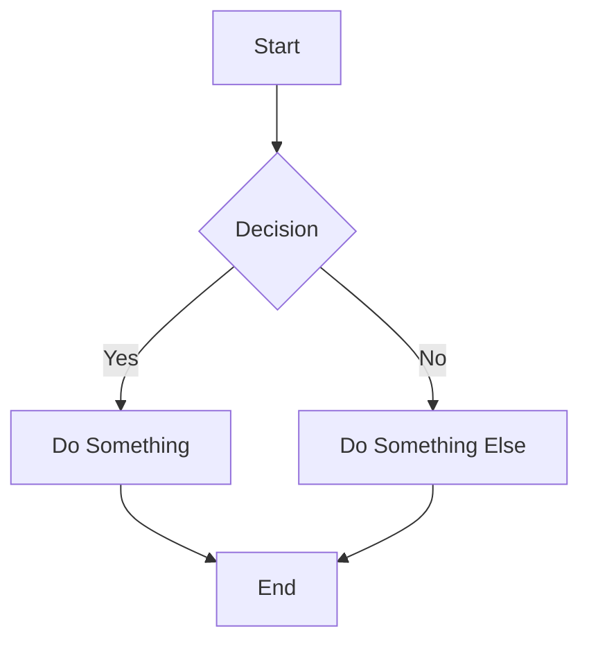

# Documentation System

A minimalist documentation rendering system for the contact-center project, featuring markdown rendering with a clean UI inspired by shadcn/ui.

## Features

### Core Functionality
- **Markdown Rendering**: Full markdown support with syntax highlighting, tables, code blocks, and more
- **Sidebar Navigation**: Left sidebar with configurable sections and pages
- **Table of Contents**: Right sidebar showing page headers (h1, h2, h3) with smooth scrolling
- **Path Security**: Built-in protection against directory traversal attacks
- **Responsive Design**: Works seamlessly on desktop and mobile devices

### Design Philosophy
- **Minimalist UI**: Clean, distraction-free reading experience
- **shadcn/ui Inspired**: Subtle borders, proper spacing, and refined typography
- **Full-Width Content**: Content spans the full width between sidebar and TOC (no max-width constraint)
- **Mermaid.js Integration**: Automatic rendering of diagrams from markdown code blocks
- **CSS Variables**: Easy theming with HSL color system
- **Smooth Interactions**: 150ms transitions for hover states and navigation
- **Accessible**: Proper contrast ratios and keyboard navigation support

## Quick Start

### Accessing Documentation

Visit `http://localhost:8000/` to view the documentation home page.

### Adding New Pages

1. Create a markdown file in the `/docs` directory:
   ```bash
   touch docs/my-new-page.md
   ```

2. Add it to the sidebar configuration in `app/docs/sidebar.yaml`:
   ```yaml
   sections:
     - title: "My Section"
       pages:
         - title: "My New Page"
           path: "my-new-page"
   ```

3. The page will be immediately available at `http://localhost:8000/my-new-page`

## Structure

```
/Users/VASILK04/Documents/contact-center/
├── app/
│   ├── docs/
│   │   ├── __init__.py
│   │   ├── router.py          # FastAPI routes and markdown rendering
│   │   ├── sidebar.yaml       # Navigation configuration
│   │   └── README.md          # Detailed documentation
│   ├── templates/
│   │   └── docs.html          # Minimalist HTML template
│   └── main.py                # App entry point (includes docs router)
├── docs/                      # Markdown documentation files
│   ├── architecture.md
│   ├── AWS_DEPLOYMENT.md
│   ├── AWS_QUICK_START.md
│   ├── AWS_SETUP_SUMMARY.md
│   ├── evaluation.md
│   └── plan/
│       └── IMPLEMENTATION_PLAN.md
└── tests/
    └── integration/
        └── test_docs.py       # Integration tests
```

## Technical Details

### Router Configuration

The documentation router is mounted at the root path (`/`) and includes:
- Home page route: `GET /`
- Dynamic page route: `GET /{page:path}`

**Important**: The docs router is registered *after* API routes to prevent the catch-all route from intercepting API calls.

### Template System

Templates use Jinja2 and are located in `app/templates/`:
- Single template: `docs.html`
- Receives context: `title`, `content`, `toc`, `sidebar`, `current_page`

### Markdown Processing

- Library: `python-markdown`
- Extensions: extra, codehilite, toc, tables, fenced_code
- Custom TOC extraction for right sidebar
- Automatic anchor generation for headings

### Styling

The UI uses CSS custom properties (variables) for easy theming:

```css
:root {
    --background: 0 0% 100%;
    --foreground: 222.2 84% 4.9%;
    --muted: 210 40% 96.1%;
    --muted-foreground: 215.4 16.3% 46.9%;
    --border: 214.3 31.8% 91.4%;
}
```

Key design elements:
- **Typography**: System fonts with proper line height (1.75 for body)
- **Spacing**: Consistent rem-based spacing
- **Borders**: Subtle 1px borders using `--border` color
- **Hover States**: 150ms transitions for smooth interactions
- **Code Blocks**: Muted background with subtle border
- **Scrollbars**: Thin 4px custom scrollbars

## Configuration

### Sidebar (app/docs/sidebar.yaml)

```yaml
sections:
  - title: "Section Name"
    pages:
      - title: "Page Title"
        path: "relative/path/to/file"  # without .md extension
```

### Supported Markdown Features

- Headers (h1-h6)
- Bold, italic, strikethrough
- Links and images
- Code blocks with syntax highlighting
- Inline code
- Tables
- Lists (ordered and unordered)
- Blockquotes
- Horizontal rules
- **Mermaid diagrams** - Use code blocks with `mermaid` language tag

## Testing

Run integration tests:
```bash
uv run pytest tests/integration/test_docs.py -v
```

Tests cover:
- Home page rendering
- Sidebar navigation
- Specific page loading
- 404 handling
- Path traversal protection
- Architecture page

## Security

- **Path Sanitization**: Removes `..` and strips leading/trailing slashes
- **Directory Restriction**: Only files within `/docs` directory are accessible
- **Path Validation**: Resolves paths and verifies they're within allowed directory
- **Error Handling**: Safe error messages without exposing file system structure

## Dependencies

- `fastapi[standard]>=0.109.0` - Web framework
- `jinja2>=3.1.0` - Template engine
- `markdown>=3.5.0` - Markdown parser
- `pyyaml>=6.0` - YAML config parser

## API Exclusion

The documentation system **does not** include:
- API endpoint schemas
- OpenAPI/Swagger documentation (available at `/docs`)
- ReDoc documentation (available at `/redoc`)

This keeps the documentation focused on conceptual and deployment information rather than API specifications.

## Development

### Adding New Features

1. Modify `app/docs/router.py` for backend changes
2. Update `app/templates/docs.html` for UI changes
3. Add tests in `tests/integration/test_docs.py`
4. Update sidebar configuration if adding new pages

### Customizing the UI

The template uses a clean, minimalist design. To customize:

1. **Colors**: Modify CSS variables in `:root`
2. **Typography**: Change font families and sizes
3. **Spacing**: Adjust padding/margin values
4. **Layout**: Modify sidebar/content/toc widths

### Running Locally

```bash
# Start the development server
uv run uvicorn app.main:app --reload

# Visit documentation
open http://localhost:8000/
```

## Mermaid Diagram Support

To add diagrams to your documentation, use a code block with the `mermaid` language tag:

~~~markdown

~~~

Supported diagram types:
- Flowcharts
- Sequence diagrams
- Class diagrams
- State diagrams
- Entity relationship diagrams
- Gantt charts
- Pie charts
- And more!

## Performance

- **Fast Rendering**: Markdown processed on-demand
- **Minimal JS**: Only smooth scrolling, TOC highlighting, and Mermaid rendering
- **Small Payload**: Single HTML file with embedded CSS
- **CDN-Based Mermaid**: Loaded from CDN (mermaid@10) for diagram rendering

## Future Enhancements

Potential improvements:
- Search functionality
- Dark mode toggle
- Versioned documentation
- Edit on GitHub links
- Page navigation (previous/next)
- Breadcrumb navigation
- PDF export
