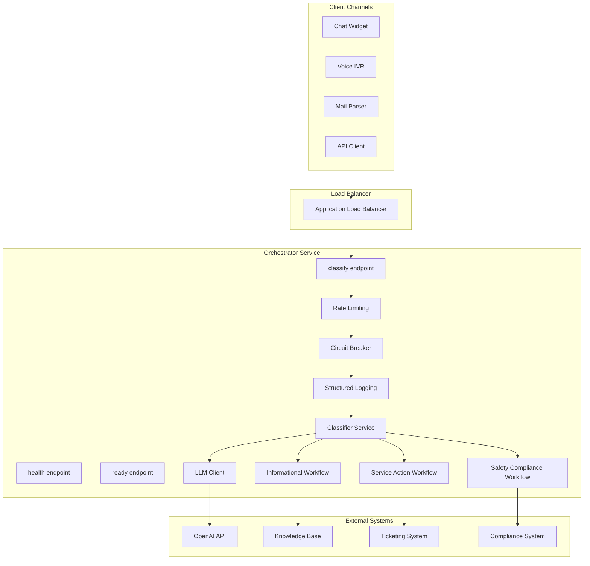

# System Architecture

## Overview

Scalable FastAPI service that classifies customer messages using AI and routes them through category-specific workflows.

## System Architecture

## Classification Flow

## Workflow Execution

### Informational Workflow
- Confidence check (≥0.5) → Search FAQ → Return answer or suggest contact
- Low confidence → Escalate to human

### Service Action Workflow
- Extract intent → Prepare action template → Return next steps
- Handles: ticket creation, order tracking, refunds, cancellations

### Safety Compliance Workflow
- Assess severity (Urgent/High/Standard) → Create compliance record → Redact PII
- SLAs: 15 min (urgent), 2 hour (high), 24 hour (standard)

## Scalability Design

### Horizontal Scaling
- **Auto-scaling**: 2-10 tasks based on CPU/memory metrics
- **Load Balancer**: Health checks, round-robin distribution
- **Stateless**: No shared state between instances

### Spike Handling
- Rate limiting (token bucket, 60 req/min)
- Circuit breaker (fail-fast on LLM errors)
- Async processing (FastAPI async/await)
- Connection pooling (HTTP reuse)

## Monitoring

**Metrics**: Request latency, confidence distribution, category distribution, LLM errors, circuit breaker state

**Logging**: Structured JSON logs, request ID tracing, PII redaction

**Health Checks**: `/api/v1/health` (liveness), `/api/v1/ready` (readiness)

## Security & Compliance

- Input validation (length limits, channel validation)
- PII redaction (automatic in safety compliance logs)
- Audit trail (compliance records)
- Secrets management (AWS Secrets Manager)
- Network security (private subnets, security groups)

## CI/CD Pipeline

**CI**: Lint → Type Check → Tests → Security Scan → Build

**CD**: Build & Push → Terraform Plan → Deploy ECS → Smoke Tests

**Environments**: Staging (auto on main), Production (on version tags)
