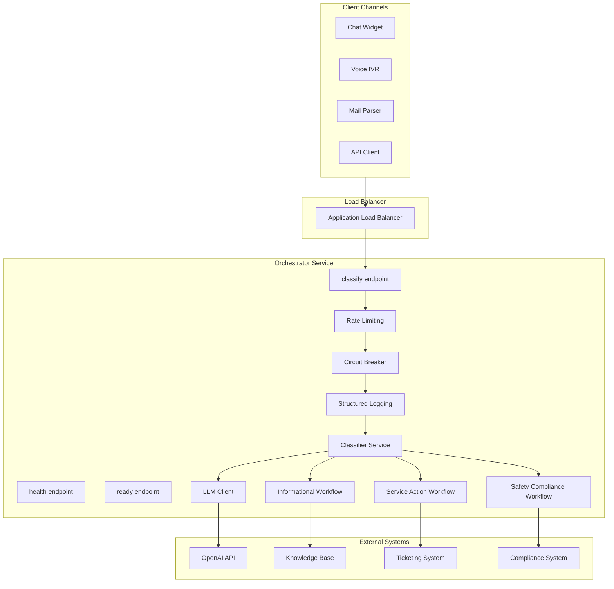
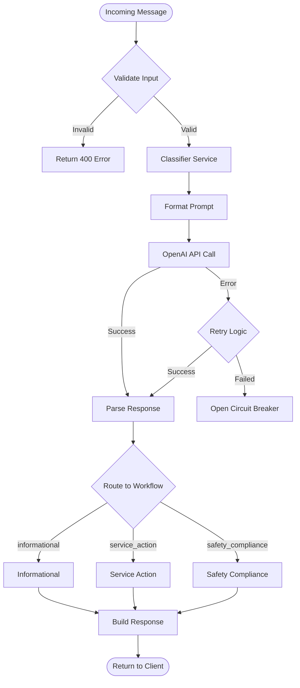

# System Architecture

Scalable FastAPI service that classifies customer messages using AI and routes them through category-specific workflows. This page is the single source for architecture and flow; see [Solution Design](solution-design) for design rationale and [Evaluation & Testing](evaluation) for test strategy and results.

## 1. Component Overview & Classification Flow

**Components**

**Classification flow**

## 2. Workflow Execution

| Workflow | Behavior |
|----------|----------|
| **Informational** | Confidence ≥0.5 → Search FAQ → Return answer or suggest contact; low confidence → Escalate to human. |
| **Service Action** | Extract intent → Prepare action template → Return next steps (ticket creation, order tracking, refunds, cancellations). |
| **Safety Compliance** | Assess severity (Urgent/High/Standard) → Create compliance record → Redact PII. SLAs: 15 min (urgent), 2 h (high), 24 h (standard). |

## 3. Scalability & Resilience

- **Horizontal scaling**: Auto-scaling 2–10 tasks (CPU/memory); load balancer with health checks; stateless instances.
- **Spike handling**: Rate limiting (token bucket, 60 req/min), circuit breaker (fail-fast on LLM errors), async FastAPI, connection pooling.

## 4. Monitoring, Security & CI/CD

- **Metrics**: Request latency, confidence/category distribution, LLM errors, circuit breaker state.
- **Logging**: Structured JSON, request ID tracing, PII redaction.
- **Health**: `/api/v1/health` (liveness), `/api/v1/ready` (readiness).
- **Security**: Input validation (length, channel), PII redaction in safety logs, audit trail, AWS Secrets Manager, private subnets and security groups.
- **CI/CD**: CI — Lint → Type Check → Tests → Security Scan → Build. CD — Build & Push → Terraform Plan → Deploy ECS → Smoke Tests. Staging on main, Production on version tags.
