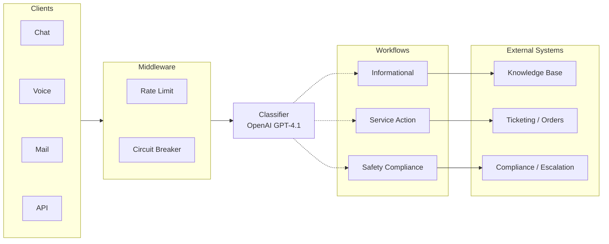

# System Architecture

Component diagrams, request flow, and API surface. For design rationale, see [Solution Design](solution-design). For test strategy, see [Evaluation & Testing](evaluation).

---

## End-to-End Pipeline

The system processes a message through a linear pipeline: clients submit messages, middleware enforces rate limits and circuit breaker policy, the classifier calls the LLM, and the dispatch layer routes the result to a category-specific workflow. The response is a structured JSON object describing the classification and the recommended next action.



---

## Request Lifecycle

Every incoming request follows the same path through the system. The middleware chain is applied before any business logic executes:


**Request ID tracing:** Every request receives a unique ID (client-provided or auto-generated UUID). This ID is returned in the `X-Request-ID` response header and included in every log entry, making it possible to trace a single request across all system components.

**Processing time:** The middleware records wall-clock time for each request and returns it in the `X-Process-Time-Ms` header and in the response body.

---

## Classification Flow with Error Handling

The classifier wraps the LLM call with retry logic and circuit breaker protection. When the LLM is unavailable, the circuit breaker short-circuits the request immediately. When the LLM returns an unparseable response, the system falls back to a conservative default.


**Fallback behavior:** If the LLM returns a response that cannot be parsed or contains an invalid category, the system defaults to `service_action` with a low confidence score. This ensures the message is still routed to a human-facing workflow rather than dropped. The low confidence triggers the human review flag, so a human will ultimately handle it.

---

## Workflow Execution

Each workflow is a self-contained strategy that receives the classification result and returns a structured action. The dispatch layer is a dictionary mapping categories to workflow instances.

### Informational Workflow

| Condition | Action | Priority |
|-----------|--------|----------|
| Confidence below threshold | Escalate to human agent | Medium |
| FAQ match found | Return FAQ answer | Low |
| No FAQ match | Suggest customer support contact | Low |

The FAQ search uses keyword matching against a curated set of common questions. When no match is found, the workflow does not attempt to generate an answer; it acknowledges the gap and routes to support.

### Service Action Workflow

| Detected Intent | Action | External System |
|----------------|--------|----------------|
| Cancel order | Process cancellation | Order management |
| Request refund | Initiate refund review | Payment system |
| Track order | Look up tracking info | Order management |
| Open ticket | Create support ticket | Ticketing system |
| Update account | Require identity verification | Account system |
| Unknown | Route to human support | Agent queue |

Intent extraction uses pattern matching (regex) against known keywords. When multiple intents could match, the first match takes precedence. When no intent can be extracted, the message is routed to human support with full context.

### Safety Compliance Workflow

| Severity | Trigger Patterns | SLA | Escalation Target |
|----------|-----------------|-----|-------------------|
| Urgent | Emergency, ER, hospital, chest pain, overdose | 15 minutes | Pharmacist (immediate) |
| High | Adverse reaction, side effect, nausea, rash | 2 hours | Pharmacist |
| Standard | General health concern | 24 hours | Compliance team |

Every safety message generates a compliance audit record containing: a unique compliance ID, timestamp, severity assessment, message hash (not the message itself), channel, and an FDA reporting flag for urgent and high severity cases. PII is redacted from the response before it leaves the system.

Human review is always required for safety messages, regardless of confidence score. This is a deliberate policy decision: the cost of autonomously mishandling a safety report is asymmetrically high.

---

## API Surface

### Classification

| Method | Path | Description |
|--------|------|-------------|
| `POST` | `/api/v1/classify` | Classify a text message |
| `POST` | `/api/v1/classify/voice` | Classify an audio message (WAV upload) |

**Request** (`POST /api/v1/classify`):
```json
{
  "message": "I am experiencing side effects from my medication",
  "channel": "chat",
  "metadata": {}
}
```

**Response:**
```json
{
  "request_id": "550e8400-e29b-41d4-a716-446655440000",
  "timestamp": "2025-01-15T10:30:00Z",
  "category": "safety_compliance",
  "confidence": 0.92,
  "decision_path": "Message reports medication side effects - safety compliance",
  "next_step": {
    "action": "pharmacist_review",
    "description": "Flagged for pharmacist review due to reported adverse reaction",
    "priority": "high",
    "requires_human_review": true,
    "external_system": "compliance_system"
  },
  "processing_time_ms": 312.5
}
```

### Health and Readiness

| Method | Path | Description |
|--------|------|-------------|
| `GET` | `/api/v1/health` | Liveness probe (Kubernetes/ECS) |
| `GET` | `/api/v1/ready` | Readiness probe (checks dependencies) |

The health endpoint always returns `200` if the process is alive. The readiness endpoint checks whether the OpenAI API key is configured and returns `degraded` if critical dependencies are not available.

### Documentation

| Method | Path | Description |
|--------|------|-------------|
| `GET` | `/docs` | Interactive documentation UI |
| `GET` | `/swagger` | Swagger UI |
| `GET` | `/redoc` | ReDoc |
| `GET` | `/openapi.json` | OpenAPI schema |

---

## Middleware Stack

Middleware is applied in order. The outermost middleware executes first:

| Layer | Responsibility |
|-------|---------------|
| **Rate Limiting** | Token bucket per client; rejects excess traffic with 429 |
| **CORS** | Allows cross-origin requests (configured for all origins in development) |
| **Request ID + Timing** | Assigns request ID, measures processing time, adds response headers |
| **Exception Handling** | Catches unhandled exceptions, returns structured error responses |

---

## Application Bootstrap

The application is assembled through a factory pattern (`app/factory.py`):

1. **Load settings** from environment variables via `pydantic-settings`.
2. **Configure logging** (human-readable in development, structured JSON in production).
3. **Create the FastAPI app** with middleware, exception handlers, and route registration.
4. **On startup** (lifespan event): load prompt templates from YAML files into the prompt registry.

The factory pattern ensures the application can be created identically in production, tests, and local development, with only environment variables differing.

---

## Code Map

| Module | Responsibility |
|--------|---------------|
| `app/main.py` | Entry point: load settings, configure logging, create app |
| `app/factory.py` | Application assembly: middleware, routes, exception handlers |
| `app/core/config.py` | Settings from environment (via pydantic-settings) |
| `app/core/logging.py` | Logging configuration: dev formatter vs JSON formatter |
| `app/core/telemetry.py` | Optional Confident AI / DeepEval integration |
| `app/api/v1/endpoints/classify.py` | Classification endpoints |
| `app/api/v1/endpoints/health.py` | Health and readiness probes |
| `app/middleware/rate_limit.py` | Token bucket rate limiter |
| `app/middleware/circuit_breaker.py` | Circuit breaker state machine |
| `app/services/classification.py` | Classifier service (orchestrates LLM call) |
| `app/services/llm.py` | OpenAI client wrapper with retry and circuit breaker |
| `app/services/dispatch.py` | Routes classification result to workflow |
| `app/workflows/informational.py` | FAQ lookup and escalation |
| `app/workflows/service_action.py` | Intent extraction and action templating |
| `app/workflows/safety_compliance.py` | Severity assessment, audit records, PII redaction |
| `app/prompts/registry.py` | Versioned prompt management and A/B experiments |
| `app/prompts/loader.py` | YAML prompt file loader |
| `app/prompts/template.py` | Prompt data model with Jinja2 rendering |
| `app/schemas/` | Pydantic models for requests, responses, and LLM output |
| `app/utils/pii_redaction.py` | Regex-based PII detection and masking |
| `app/utils/audio.py` | WAV to PCM16 conversion for voice classification |
