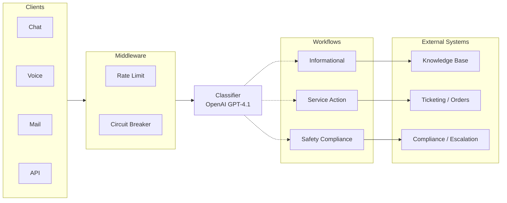
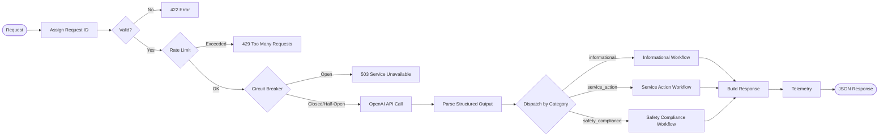
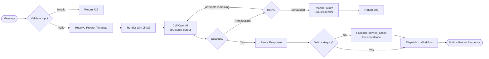
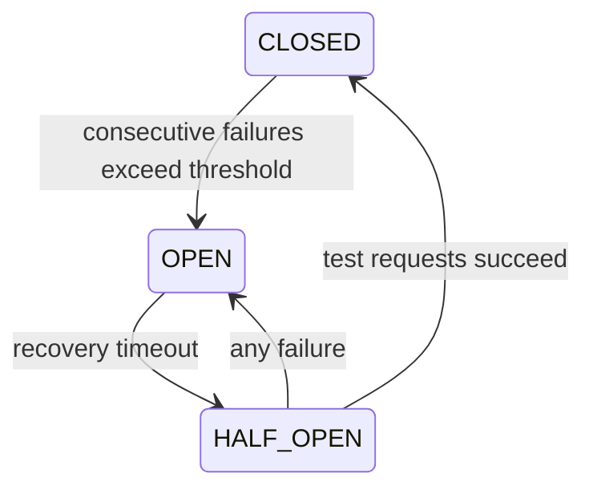
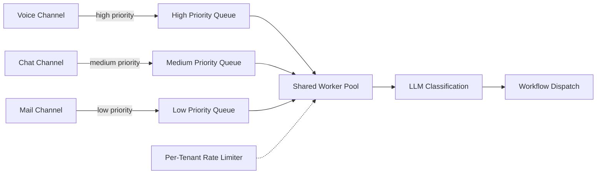

# Architecture

Component diagrams, request flow, and workflow details. For API endpoints and code map, see [API Reference](api-reference). For design rationale, see [Design Decisions](design-decisions).

---

## End-to-End Pipeline

The system processes a message through a linear pipeline: clients submit messages, middleware enforces rate limits and circuit breaker policy, the classifier calls the LLM, and the dispatch layer routes the result to a category-specific workflow. The response is a structured JSON object describing the classification and the recommended next action.

---

## Request Lifecycle

Every incoming request follows the same path through the system. The middleware chain is applied before any business logic executes:

**Request ID tracing:** Every request receives a unique ID (client-provided or auto-generated UUID). This ID is returned in the `X-Request-ID` response header and included in every log entry, making it possible to trace a single request across all system components.

**Processing time:** The middleware records wall-clock time for each request and returns it in the `X-Process-Time-Ms` header and in the response body.

---

## Classification Flow with Error Handling

The classifier wraps the LLM call with retry logic and circuit breaker protection. When the LLM is unavailable, the circuit breaker short-circuits the request immediately. When the LLM returns an unparseable response, the system falls back to a conservative default.

**Fallback behavior:** If the LLM returns a response that cannot be parsed or contains an invalid category, the system defaults to `service_action` with a low confidence score. This ensures the message is still routed to a human-facing workflow rather than dropped. The low confidence triggers the human review flag, so a human will ultimately handle it.

---

## Circuit Breaker State Machine

The circuit breaker tracks consecutive LLM failures and transitions between three states:

When **open**, all requests are rejected immediately with `503`. After the recovery timeout, a **half-open** probe allows a small number of test requests through. If they succeed, the circuit **closes** and normal operation resumes.

---

## Recommended Target Architecture

For a production deployment handling multiple channels and tenants at scale, the recommended default architecture combines **async processing**, **priority queues**, **per-tenant rate limiting**, and **shared workers**.

| Concern | Approach |
|---------|----------|
| **Channel priority** | Voice → high, Chat → medium, Mail → low. Workers always drain higher-priority queues first, so time-sensitive voice messages are classified before batch email |
| **Async ingestion** | Requests are enqueued immediately and return a job ID. Clients poll or receive a webhook callback. This decouples ingestion throughput from LLM latency |
| **Per-tenant rate limiting** | Each tenant gets an independent token bucket (Redis-backed). Prevents a single noisy tenant from starving others while allowing fair burst capacity |
| **Shared worker pool** | A single pool of workers processes all queues. Workers are stateless and scale horizontally. This maximises LLM utilisation without dedicating capacity per channel |

This architecture preserves every resilience pattern already in place (circuit breaker, confidence thresholds, human escalation) while adding the multi-tenancy and channel-awareness needed for production scale.

---

## Workflow Execution

Each workflow is a self-contained strategy that receives the classification result and returns a structured action. The dispatch layer is a dictionary mapping categories to workflow instances.

### Informational Workflow

| Condition | Action | Priority |
|-----------|--------|----------|
| Confidence below threshold | Escalate to human agent | Medium |
| FAQ match found | Return FAQ answer | Low |
| No FAQ match | Suggest customer support contact | Low |

The FAQ search uses keyword matching against a curated set of common questions. When no match is found, the workflow does not attempt to generate an answer; it acknowledges the gap and routes to support.

### Service Action Workflow

| Detected Intent | Action | External System |
|----------------|--------|----------------|
| Cancel order | Process cancellation | Order management |
| Request refund | Initiate refund review | Payment system |
| Track order | Look up tracking info | Order management |
| Open ticket | Create support ticket | Ticketing system |
| Update account | Require identity verification | Account system |
| Unknown | Route to human support | Agent queue |

Intent extraction uses pattern matching (regex) against known keywords. When multiple intents could match, the first match takes precedence. When no intent can be extracted, the message is routed to human support with full context.

### Safety Compliance Workflow

| Severity | Trigger Patterns | SLA | Escalation Target |
|----------|-----------------|-----|-------------------|
| Urgent | Emergency, ER, hospital, chest pain, overdose | 15 minutes | Pharmacist (immediate) |
| High | Adverse reaction, side effect, nausea, rash | 2 hours | Pharmacist |
| Standard | General health concern | 24 hours | Compliance team |

Every safety message generates a compliance audit record containing: a unique compliance ID, timestamp, severity assessment, message hash (not the message itself), channel, and an FDA reporting flag for urgent and high severity cases. PII is redacted from the response before it leaves the system.

Human review is always required for safety messages, regardless of confidence score. This is a deliberate policy decision: the cost of autonomously mishandling a safety report is asymmetrically high.
