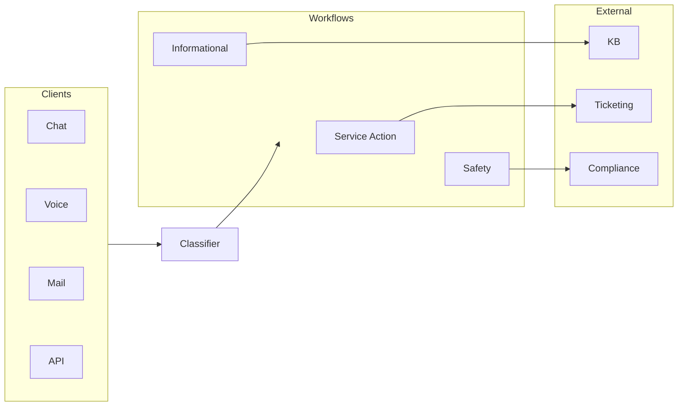
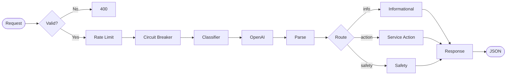
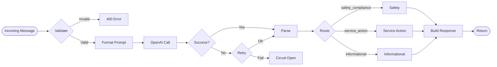

# System Architecture

Scalable FastAPI service that classifies customer messages using AI and routes them through category-specific workflows. See [Solution Design](solution-design) for rationale and [Evaluation & Testing](evaluation) for test strategy and results.

## 1. Component Overview & Classification Flow

### Pipeline (left → right)

End-to-end flow in one horizontal view: clients → load balancer → gateway → classifier → workflows → external systems.



### Request path (horizontal)

What happens inside the orchestrator for each classify request:



### Classification flow (step-by-step)

Same logic as above, with branches and error handling:



## 2. Workflow Execution

| Workflow | Behavior |
|----------|----------|
| **Informational** | Confidence ≥0.5 → Search FAQ → Return answer or suggest contact; low confidence → Escalate to human. |
| **Service Action** | Extract intent → Prepare action template → Return next steps (ticket, order tracking, refunds, cancellations). |
| **Safety Compliance** | Assess severity (Urgent/High/Standard) → Create compliance record → Redact PII. SLAs: 15 min (urgent), 2 h (high), 24 h (standard). |

## 3. Scalability & Resilience

- **Horizontal scaling:** Auto-scaling 2–10 tasks (CPU/memory); load balancer with health checks; stateless instances.
- **Spike handling:** Rate limiting (token bucket, 60 req/min), circuit breaker (fail-fast on LLM errors), async FastAPI, connection pooling.

## 4. API Endpoints

| Method | Path | Description |
|--------|------|-------------|
| `POST` | `/api/v1/classify` | Classify text message |
| `POST` | `/api/v1/classify/voice` | Classify audio message |
| `POST` | `/api/v1/classify/{id}/feedback` | Submit classification feedback |
| `GET` | `/api/v1/classify/{id}/feedback` | Retrieve feedback |
| `GET` | `/api/v1/health` | Liveness check |
| `GET` | `/api/v1/ready` | Readiness check |

**Feedback** (for continuous improvement):

```json
POST /api/v1/classify/{request_id}/feedback
{
  "correct": false,
  "expected_category": "safety_compliance",
  "comment": "This message mentions medication side effects"
}
```

## 5. Monitoring & Logging

- **Confident AI:** When `CONFIDENT_API_KEY` is set, classifications are traced (input, category, confidence, processing time, model). See `app/core/telemetry.py`.
- **Structured logging:** JSON logs with request_id, category, confidence, processing_time_ms, PII-redacted message preview.

## 6. Application Flow (Code)

- **Entry:** `main.py` → `create_app()` in `app/factory.py` (middleware, routes, exception handlers).
- **Core:** Config, logging, telemetry in `app/core/`.
- **Request path:** Middleware → API (`/api/v1`), docs, or QA UI. Classification: `app/api/v1/endpoints/classify.py` → `ClassifierService` → `app/services/workflow_router.py` → workflows in `app/workflows/`.
- **Where to look:** App assembly → `app/factory.py`. Classify request → `classify.py` → `ClassifierService` → `workflow_router.py` → workflows.
