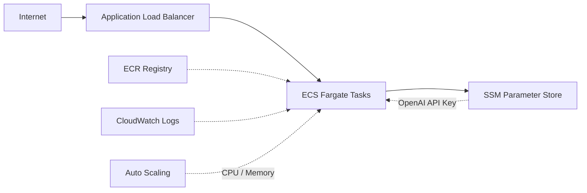

# AWS Architecture

How the Contact Center AI Orchestrator maps onto AWS infrastructure.

## Infrastructure Overview



| Resource | Purpose |
|----------|---------|
| **ECS Cluster** | Fargate cluster — no EC2 instances to manage |
| **ECS Service** | Maintains desired task count, rolling deploys |
| **ALB** | HTTP load balancing, health check routing |
| **ECR** | Private container registry for the app image |
| **SSM Parameter Store** | Encrypted storage for the OpenAI API key |
| **Security Groups** | ALB accepts HTTP; ECS accepts traffic only from ALB |

## Auto Scaling

- **Triggers:** CPU > 70% or memory > 80% → scale out
- **Range:** configurable `min_capacity` / `max_capacity` (default 1–2 tasks)
- **Cooldowns:** 60s scale-out, 300s scale-in to avoid flapping

## Health Checks

ALB and ECS container health checks both target `/api/v1/health` (30s interval). Unhealthy tasks are replaced automatically.

## CI/CD Pipeline

**GitHub Actions:** push to `main` → staging; version tag → production.

Pipeline stages: build image → push to ECR → `terraform apply` → smoke tests.

**Secrets required:** `AWS_ROLE_ARN`, `OPENAI_API_KEY`.

## Monitoring

- **Logs:** CloudWatch Logs group `/ecs/{project_name}`
- **ECS metrics:** CPUUtilization, MemoryUtilization
- **ALB metrics:** RequestCount, TargetResponseTime, 5XX rate

## Rollback

Update the container image tag to a previous version:

```bash
terraform apply -var="container_image=ECR_URL:previous-tag"
```

Or revert the ECS task definition to a prior revision in the console.

## Cost Estimate

Default configuration (1 task, 0.25 vCPU, 512 MB): **~$30–40/month** (Fargate + ALB + data transfer).
