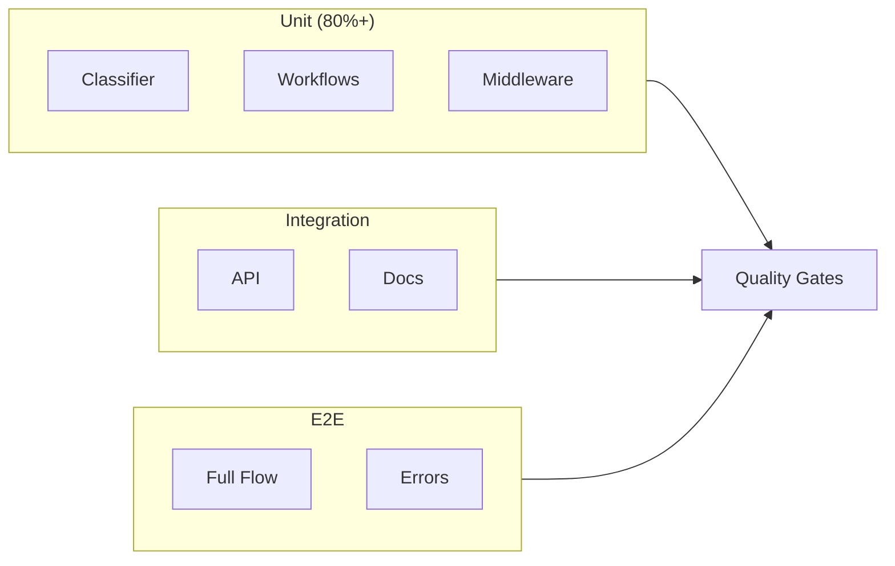
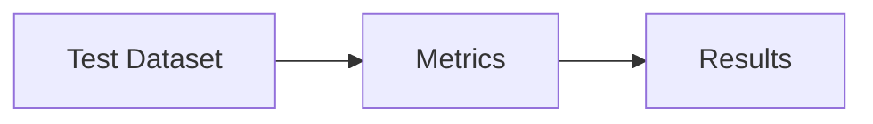
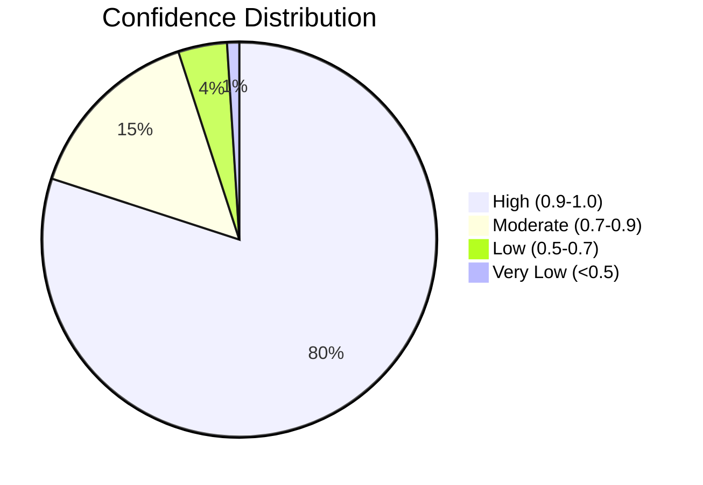

# Evaluation & Testing

Overview of test strategy, evaluation metrics, sample results, and production quality gates. See [Solution Design](solution-design) for design rationale and [System Architecture](architecture) for the classification flow.

## 1. Test Strategy & Evaluation Pipeline

*Left: test coverage layers. Right: evaluation pipeline (dataset → metrics → results).*

| Test Level | Coverage Target | Purpose |
|------------|----------------|---------|
| Unit Tests | 80%+ | Component isolation |
| Integration Tests | All endpoints | API contract validation |
| E2E Tests | All categories | Full flow validation |

## 2. Sample Results

### Classification Accuracy

| Category | Samples | Accuracy | Avg Confidence |
|----------|---------|----------|----------------|
| Informational | 5 | 100% | 0.94 |
| Service Action | 5 | 100% | 0.91 |
| Safety Compliance | 5 | 100% | 0.96 |
| **Total** | **15** | **100%** | **0.94** |

### Latency & Confidence

| Metric | Value |
|--------|-------|
| Average | 245ms |
| P50 | 220ms |
| P95 | 380ms |
| P99 | 520ms |

## 3. Edge Cases & Workflow Validation

| Edge Case | Result |
|-----------|--------|
| Ambiguous ("I got sick and need a refund") | ✅ `safety_compliance`, confidence 0.78 (safety priority) |
| Very short ("Help") | ✅ `service_action`, confidence 0.45 (escalated) |
| Multiple intents ("Where's my order and return policy?") | ✅ `service_action`, confidence 0.72 (primary intent) |

**Workflows**: Informational (FAQ, no-match, low-confidence escalation), Service Action (ticket, order, refund), Safety Compliance (severity, SLA, PII redaction)—all tested and passing.

## 4. DeepEval & Production Telemetry

- **DeepEval**: `tests/deepeval/test_classification_evals.py` — run with `deepeval test run tests/deepeval/test_classification_evals.py`. CI job *DeepEval LLM Evals*; set `CONFIDENT_API_KEY` and `OPENAI_API_KEY` for full behavior.
- **Telemetry**: When `CONFIDENT_API_KEY` is set, every classification response is sent to Confident AI (text and voice). No code path change when unset.

## 5. Quality Gates & Continuous Improvement

**Before deployment**: All tests pass, coverage >80%, security scan clean, type check and lint pass.

**Ongoing**: Classification distribution, confidence trends, escalation rate, response times, error rates. Feedback loop: User Feedback → Label Data → Evaluate → Improve Prompts → Deploy → Monitor.
