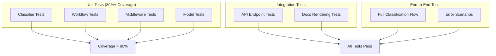
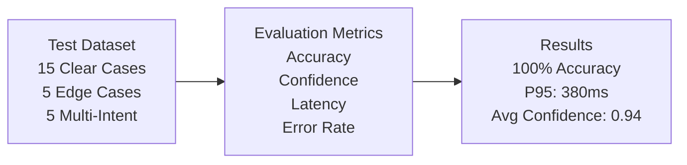
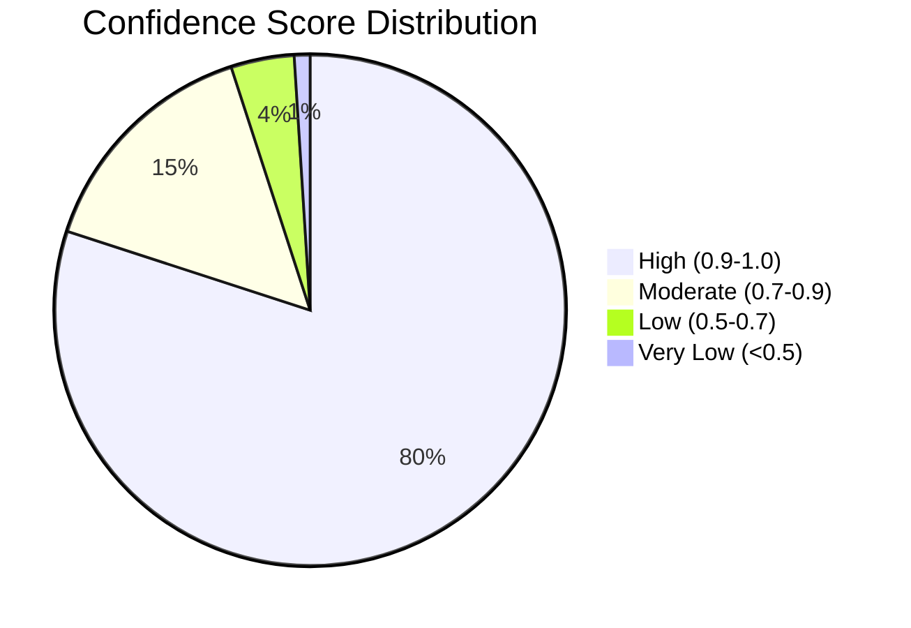

# Evaluation & Testing

## Test Coverage Strategy

| Test Level | Coverage Target | Purpose |
|------------|----------------|---------|
| Unit Tests | 80%+ | Component isolation |
| Integration Tests | All endpoints | API contract validation |
| E2E Tests | All categories | Full flow validation |

## Evaluation Metrics

## Sample Results

### Classification Accuracy

| Category | Samples | Accuracy | Avg Confidence |
|----------|---------|----------|----------------|
| Informational | 5 | 100% | 0.94 |
| Service Action | 5 | 100% | 0.91 |
| Safety Compliance | 5 | 100% | 0.96 |
| **Total** | **15** | **100%** | **0.94** |

### Latency Performance

| Metric | Value |
|--------|-------|
| Average | 245ms |
| P50 | 220ms |
| P95 | 380ms |
| P99 | 520ms |

### Confidence Distribution

## Edge Case Handling

| Edge Case | Result |
|-----------|--------|
| Ambiguous ("I got sick and need a refund") | ✅ `safety_compliance`, confidence 0.78 (safety priority) |
| Very short ("Help") | ✅ `service_action`, confidence 0.45 (escalated) |
| Multiple intents ("Where's my order and return policy?") | ✅ `service_action`, confidence 0.72 (primary intent) |

## Workflow Validation

All workflows tested and passing:
- **Informational**: FAQ matching, no-match handling, low confidence escalation
- **Service Action**: Ticket creation, order tracking, refund flow
- **Safety Compliance**: Severity assessment, SLA routing, PII redaction

## DeepEval CI & Real-Time Monitoring

- **Tests**: 2–3 DeepEval evals in `tests/deepeval/test_classification_evals.py` (informational, service_action, safety_compliance).
- **Run locally**: `deepeval test run tests/deepeval/test_classification_evals.py`
- **CI**: The `DeepEval LLM Evals` job runs these tests. Set these repository secrets for full behavior:
  - `CONFIDENT_API_KEY`: Enables real-time monitoring (results sent to Confident AI).
  - `OPENAI_API_KEY`: Required for GEval (LLM-as-judge) in CI.

## Production Telemetry

When `CONFIDENT_API_KEY` is set in the environment (e.g. in production), **every classification response** is sent as telemetry to Confident AI:

- **Text classify** (`POST /api/v1/classify`): input message, channel, and full response (category, confidence, next_step, etc.) are recorded as a trace.
- **Voice classify** (`POST /api/v1/classify/voice`): response is recorded as a trace (input tagged as voice).

No code path changes when the key is unset; telemetry is a no-op. Set `CONFIDENT_API_KEY` in your production environment (or in `.env`) to enable full response telemetry and optional online evals in the Confident AI dashboard.

## Quality Gates

Before deployment:
- ✅ All tests pass
- ✅ Coverage > 80%
- ✅ Security scan clean
- ✅ Type checking passes
- ✅ Linting passes

## Continuous Improvement

**Production Metrics**: Classification distribution, confidence trends, escalation rate, response times, error rates

**Feedback Loop**: User Feedback → Label Data → Evaluate → Improve Prompts → Deploy → Monitor
