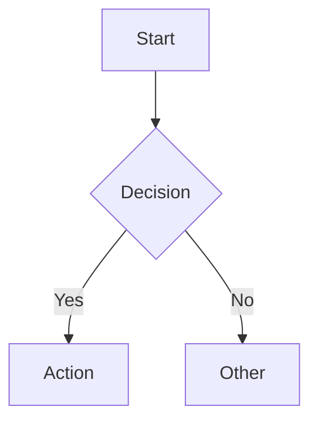

# Frontend & Documentation UI

The app exposes a **documentation UI** that renders markdown from the `docs/` folder with a sidebar and table of contents. This page describes how to use and customize it.

## What You See

- **Home:** Documentation landing (or first configured page).
- **Sidebar (left):** Sections and pages; click to navigate.
- **Content (center):** Rendered markdown with syntax highlighting, tables, and Mermaid diagrams.
- **Table of contents (right):** Headings (h1–h3) with smooth scroll to sections.

## Accessing the Docs

- **Local:** Run the app, then open `http://localhost:8000/`.
- **Deployed:** Same base URL as the API (e.g. `https://your-alb-url/`).

API docs (Swagger/ReDoc) are separate: `/swagger`, `/redoc`.

## Features

| Feature | Description |
|---------|-------------|
| **Markdown** | Headers, lists, code blocks, tables, blockquotes, links, images |
| **Mermaid** | Diagrams in fenced code blocks with `mermaid` language tag |
| **Sidebar** | Configurable sections and pages via YAML |
| **TOC** | Auto-generated from page headings; smooth scroll |
| **Responsive** | Usable on desktop and mobile |
| **Theming** | CSS variables (HSL) for colors, spacing, typography |

## Adding or Changing Pages

1. **Add a markdown file** under `docs/`, e.g. `docs/my-page.md`.
2. **Register it** in `app/frontend/docs/sidebar.yaml`:

```yaml
sections:
  - title: "My Section"
    pages:
      - title: "My Page"
        path: "my-page"   # URL path, no .md
```

3. The page is available at `http://localhost:8000/my-page`.

## Customizing the Look

The docs template is in `app/frontend/templates/docs.html`. Key levers:

| What | Where |
|------|--------|
| **Colors** | CSS variables in `:root` (e.g. `--background`, `--foreground`, `--border`) |
| **Typography** | Font families and sizes in the template |
| **Spacing** | Padding and margin (rem-based) |
| **Layout** | Sidebar and TOC widths in the template |

Design is minimalist, shadcn/ui-inspired: subtle borders, consistent spacing, 150ms hover transitions.

## Mermaid Diagrams

In any doc, use a code block with the `mermaid` language:

````markdown

````

Supports flowcharts, sequence diagrams, and other Mermaid types.

## File Structure (Reference)

| Path | Purpose |
|------|---------|
| `docs/*.md` | Markdown content (what the sidebar links to) |
| `app/frontend/docs/sidebar.yaml` | Sidebar sections and page list |
| `app/frontend/docs/router.py` | Routes and markdown rendering |
| `app/frontend/templates/docs.html` | HTML layout, CSS, sidebar, TOC |

The docs router is mounted at `/` and is registered after API routes so `/api/*` is not captured.
