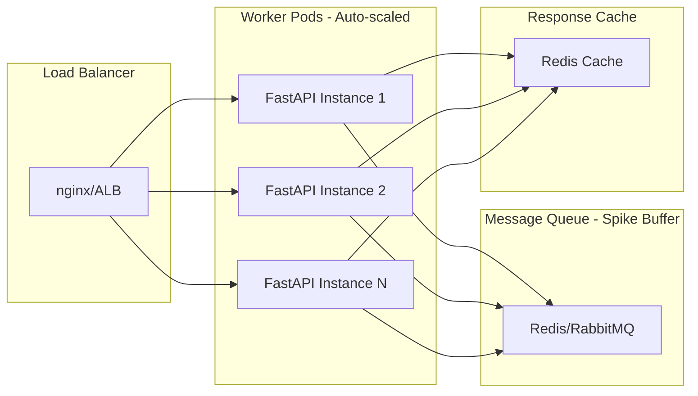

# Contact-Center Mini AI Orchestrator - Implementation Plan

## System Architecture Overview

```mermaid
flowchart TB
    subgraph clients [Client Channels]
        Chat[Chat]
        Voice[Voice]
        Mail[Mail]
    end
    
    subgraph api [FastAPI Service]
        Endpoint[/classify endpoint]
        RateLimit[Rate Limiter]
    end
    
    subgraph core [Core Logic]
        Classifier[AI Classifier]
        Workflows[Workflow Router]
    end
    
    subgraph llm [OpenAI]
        GPT4[GPT-4]
    end
    
    subgraph external [External Systems - Stubbed]
        KB[Knowledge Base]
        Ticketing[Ticketing System]
        Compliance[Compliance System]
    end
    
    clients --> Endpoint
    Endpoint --> RateLimit
    RateLimit --> Classifier
    Classifier --> GPT4
    Classifier --> Workflows
    Workflows -.-> KB
    Workflows -.-> Ticketing
    Workflows -.-> Compliance
```

## Project Structure (Flat & Simple)

```
principal_swe_assignment/
├── app/
│   ├── __init__.py
│   ├── main.py                    # FastAPI app + routes
│   ├── config.py                  # Configuration
│   ├── models.py                  # Pydantic models (request/response)
│   ├── classifier.py              # AI classifier with OpenAI
│   ├── prompts.py                 # Optimized prompt templates
│   ├── workflows.py               # E2E workflow logic
│   └── middleware.py              # Rate limiting + logging
├── tests/
│   ├── conftest.py                # Pytest fixtures
│   ├── test_classifier.py         # Classifier tests
│   ├── test_workflows.py          # Workflow tests
│   ├── test_api.py                # API integration tests
│   └── test_prompts.py            # Prompt evaluation tests
├── .github/
│   └── workflows/
│       └── ci.yml                 # GitHub Actions CI/CD
├── Dockerfile
├── docker-compose.yml
├── pyproject.toml                 # uv configuration
├── .python-version                # Python 3.11+
├── ruff.toml                      # Ruff config
├── pyrightconfig.json             # Pyright config
├── .env.example
├── ARCHITECTURE.md                # Architecture + prompt design docs
└── README.md
```

## Key Components

### 1. API Design

**Main Classification Endpoint**: `POST /api/v1/classify`

Request:

```json
{
  "message": "I experienced severe headache after taking the medication",
  "channel": "chat",
  "session_id": "optional-session-id",
  "metadata": {}
}
```

Response:

```json
{
  "category": "safety_compliance",
  "confidence": 0.92,
  "decision_path": [
    "Detected adverse reaction keywords",
    "Medical symptom pattern identified",
    "Classified as safety compliance issue"
  ],
  "next_step": {
    "action": "escalate_to_pharmacovigilance",
    "priority": "high",
    "message": "Your report has been flagged for immediate review by our safety team."
  },
  "workflow_result": {
    "ticket_id": "SAF-2026-001234",
    "status": "created"
  }
}
```

### 2. Optimized AI Classifier Design

**Core Prompt Strategy - Chain-of-Thought with Structured Output**

```python
# Use OpenAI's Structured Outputs (JSON mode) with gpt-4o or gpt-4-turbo
# Prompt structure:
# 1. Role definition with context
# 2. Category definitions with clear boundaries
# 3. Few-shot examples (3 per category)
# 4. Chain-of-thought reasoning template
# 5. Structured JSON output schema
```

**Key Optimizations:**

1. **Structured Outputs**: Use OpenAI's `response_format={"type": "json_object"}` to enforce valid JSON
2. **Chain-of-Thought**: Ask model to think step-by-step before classification
3. **Few-Shot Examples**: Include 3 diverse examples per category showing edge cases
4. **Confidence Calibration**: 

   - Model outputs raw confidence (0.0-1.0)
   - Apply temperature=0 for consistency
   - Log probabilities for calibration analysis

5. **Decision Path**: Extract reasoning from chain-of-thought for transparency

**Prompt Template Structure:**

```
System: You are a healthcare customer service classifier...
[Clear category definitions with examples]
[Safety-first bias: when in doubt, escalate to safety_compliance]

User: Classify this message step-by-step:
1. Identify key entities (symptoms, actions, questions)
2. Check for safety keywords (adverse reactions, harm)
3. Determine primary intent
4. Assign category and confidence

Message: {user_message}
Output JSON: {category, confidence, reasoning, keywords}
```

**Confidence Thresholds:**

- High (>= 0.85): Auto-process
- Medium (0.60-0.85): Process with logging
- Low (< 0.60): Flag for human review

**Concrete Implementation** (in `app/prompts.py`):

Use OpenAI's `response_format={"type": "json_object"}` with few-shot examples embedded in the system prompt. Extract reasoning, keywords, category, and confidence in a single structured output. Apply temperature=0 for deterministic results.

### 3. E2E Workflows

| Category | Workflow Steps | External Integration (Stubbed) |

|----------|---------------|-------------------------------|

| **Informational** | Parse query -> Search KB -> Format response | Knowledge Base API |

| **Service Action** | Extract intent -> Validate data -> Create ticket | Ticketing System |

| **Safety Compliance** | Flag as urgent -> Collect details -> Create adverse event report | Pharmacovigilance System |

### 4. Scalability Architecture



Design for spikes:

- Async FastAPI with uvicorn workers
- Rate limiting per client
- Optional Redis queue for backpressure handling
- Response caching for similar queries
- Horizontal pod autoscaling (HPA) in Kubernetes

### 5. CI/CD Pipeline


GitHub Actions stages:

1. **Lint & Format**: `ruff check` and `ruff format --check`
2. **Type Check**: `pyright` for static type analysis
3. **Test**: `pytest` with coverage (minimum 80%)
4. **Build**: Docker image build and push
5. **Deploy**: docker-compose deployment

### 6. Prompt Evaluation Strategy

**Test Dataset**: Create 30+ test cases covering:

- Clear cases (10 per category)
- Edge cases (ambiguous messages)
- Multi-intent messages
- Safety-critical false negatives

**Evaluation Metrics**:

- Accuracy per category
- Precision/Recall for safety_compliance (most critical)
- Confidence calibration (Expected Calibration Error)
- Latency (p50, p95, p99)

**Prompt Iteration**:

1. Baseline: Simple classification prompt
2. Add few-shot examples
3. Add chain-of-thought reasoning
4. Tune confidence thresholds based on ROC curve
5. Safety-first bias tuning

### 7. Monitoring Strategy

- **Metrics**: Prometheus metrics (request latency, classification distribution, confidence histograms)
- **Logging**: Structured JSON logs with correlation IDs, prompt/response for debugging
- **Alerts**: Low confidence rate alerts, error rate thresholds, safety_compliance spike detection
- **Dashboards**: Grafana for visualization

### 8. Compliance Considerations

- PII redaction in logs
- Audit trail for safety_compliance cases
- Configurable data retention policies
- No persistent storage of raw messages (process and discard)

## Technology Choices

| Component | Choice | Rationale |

|-----------|--------|-----------|

| Package Manager | **uv** | Fastest Python package manager, simple workflow |

| Linting & Formatting | **ruff** | All-in-one, extremely fast linter and formatter |

| Type Checking | **pyright** | Fast, accurate, integrates with Cursor/VSCode |

| Testing | pytest + pytest-asyncio | Industry standard, async support |

| LLM Provider | **OpenAI (gpt-4o)** | Best-in-class, structured outputs support |

| Containerization | Docker + docker-compose | Portable, reproducible |

| CI/CD | GitHub Actions | Integrated, free for public repos |

## Assumptions and Tradeoffs

1. **OpenAI only**: Requires API key (cost ~$0.01-0.03 per request with gpt-4o). More accurate than local models. User must provide API key.
2. **Single LLM call**: Prioritizes latency (~1-2s) over multi-step reasoning. Optimized with structured outputs and chain-of-thought.
3. **Flat structure**: Reduces complexity but less modular. Acceptable for this scope (single service, ~1000 LOC).
4. **Stubbed external systems**: Real integrations would require actual service contracts.
5. **Chat-only implementation**: Voice/mail channels designed but not implemented per requirements.
6. **In-memory rate limiting**: For production, use Redis-based distributed rate limiting.
7. **Safety-first bias**: Prompt tuned to prefer safety_compliance classification when uncertain (acceptable false positive rate).

## Implementation Order

Key files to create (in order):

1. **Setup**: `pyproject.toml`, `ruff.toml`, `pyrightconfig.json`, `.python-version`, `.env.example`
2. **Core Logic**:

   - `app/models.py` - Pydantic models (request/response schemas)
   - `app/prompts.py` - Optimized prompt templates with chain-of-thought
   - `app/classifier.py` - OpenAI integration + classification logic
   - `app/workflows.py` - E2E workflow implementations (3 categories)

3. **API Layer**:

   - `app/config.py` - Settings management with pydantic-settings
   - `app/middleware.py` - Rate limiting + structured logging
   - `app/main.py` - FastAPI app with routes

4. **Testing**:

   - `tests/conftest.py` - Fixtures (mocked OpenAI client)
   - `tests/test_prompts.py` - Prompt evaluation suite
   - `tests/test_classifier.py` - Unit tests
   - `tests/test_workflows.py` - Workflow tests
   - `tests/test_api.py` - Integration tests

5. **Infrastructure**:

   - `Dockerfile` - Multi-stage build
   - `docker-compose.yml` - Service orchestration
   - `.github/workflows/ci.yml` - CI/CD pipeline

6. **Documentation**:

   - `ARCHITECTURE.md` - System design + prompt engineering rationale
   - `README.md` - Setup instructions + API docs