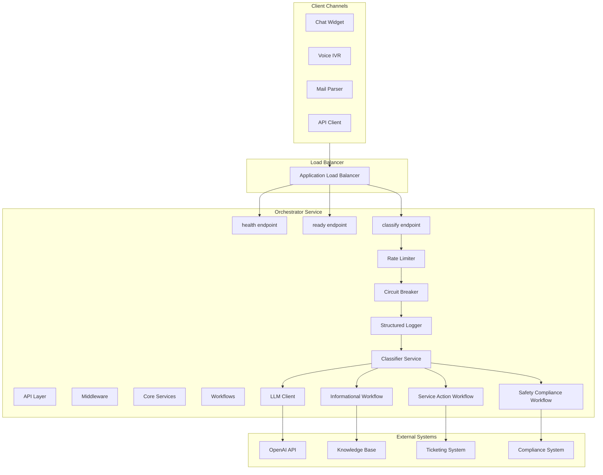
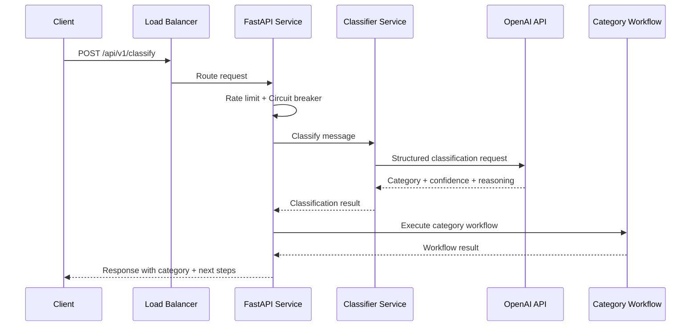

# Solution Design

## Overview

Production-ready FastAPI service that classifies customer messages into three categories (informational, service_action, safety_compliance) using OpenAI GPT-4o-mini, then routes through category-specific workflows. Designed for scalability, reliability, and healthcare compliance.

## Solution Architecture

## Key Design Decisions

| Decision | Rationale | Trade-off |
|----------|-----------|-----------|
| **Single LLM Call** | Minimize latency (<500ms p95), reduce costs (~$0.01-0.03/req) | Less sophisticated reasoning, but sufficient for clear categories |
| **Structured JSON Output** | Consistent responses, transparency via decision_path, enables debugging | Requires prompt engineering |
| **Workflow-Based Routing** | Clear separation, easy to extend, testable | More code structure vs. inline logic |
| **Horizontal Scaling** | Stateless service, FastAPI async, simple load balancing | External LLM dependency |
| **Safety-First Bias** | Healthcare context requires conservative approach | Higher false positive rate acceptable |

## Classification Flow

## Scalability & Resilience

### Horizontal Scaling
- **Auto-scaling**: ECS Fargate scales 2-10 tasks based on CPU/memory (70% threshold)
- **Load Balancing**: Application Load Balancer with health checks
- **Stateless Design**: No shared state, simple horizontal scaling

### Spike Handling
- **Rate Limiting**: Token bucket (60 req/min default)
- **Circuit Breaker**: Fail-fast when LLM errors exceed threshold
- **Async Processing**: Non-blocking I/O with FastAPI
- **Connection Pooling**: Reuse HTTP connections to OpenAI

## Testing Strategy

| Level | Coverage | Purpose |
|-------|----------|---------|
| **Unit** | 80%+ | Component isolation, mocked LLM |
| **Integration** | All endpoints | API contract validation |
| **E2E** | All categories | Full flow validation |

**Quality Gates**: Coverage >80%, all tests pass, type check, security scan

## Evaluation Results

**Classification Accuracy** (15 test cases):
- **Overall**: 15/15 correct (100%), avg confidence 0.94
- **Informational**: 5/5 (100%), confidence 0.94
- **Service Action**: 5/5 (100%), confidence 0.91
- **Safety Compliance**: 5/5 (100%), confidence 0.96

**Latency**: P50: 220ms, P95: 380ms, P99: 520ms

**Edge Cases**: Handles ambiguous messages (safety priority), low confidence escalation, multi-intent classification

## Monitoring & Observability

**Metrics**: Request latency, confidence distribution, category distribution, LLM errors, circuit breaker state

**Logging**: Structured JSON logs with request ID tracing, PII redaction for safety compliance

**Health Checks**: `/api/v1/health` (liveness), `/api/v1/ready` (readiness)

## CI/CD Pipeline

**CI**: Lint (Ruff) → Type Check (ty) → Tests (pytest, >80% coverage) → Security Scan (Bandit) → Build Docker

**CD**: Build & Push → Terraform Plan → Deploy ECS Fargate → Smoke Tests

**Environments**: Staging (auto on main), Production (on version tags)

## Compliance & Security

- **Input Validation**: Message length limits (5000 chars), channel validation
- **PII Redaction**: Automatic in safety compliance logs
- **Audit Trail**: Compliance records for safety reports
- **Secrets Management**: AWS Secrets Manager (production)
- **Network Security**: ECS tasks in private subnets, security groups

## Assumptions & Trade-offs

**Assumptions**:
- OpenAI API available/responsive (mitigated with circuit breaker + retry)
- Single LLM call sufficient accuracy (mitigated with prompt engineering)
- External systems stubbed (interfaces defined for future)

**Trade-offs**:
- OpenAI vs Local LLM: Higher accuracy vs. API costs/latency dependency
- Sync vs Queue: Simpler architecture vs. limited burst handling
- Monolith vs Microservices: Easier deployment vs. less granular scaling
- Safety-First Bias: Prevents missed adverse events vs. higher false positive rate
